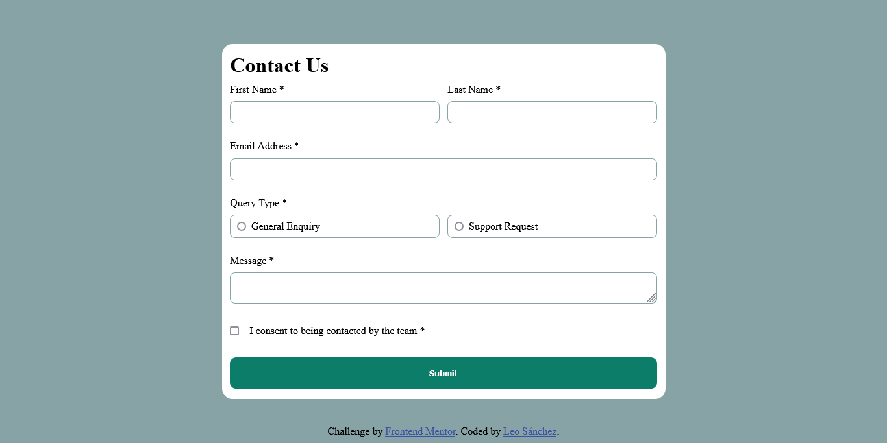
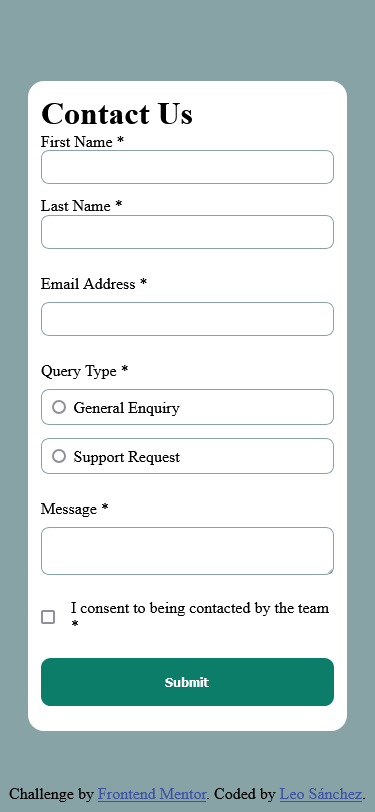

# Frontend Mentor - Contact form solution

This is a solution to
the [Contact form challenge on Frontend Mentor](https://www.frontendmentor.io/challenges/contact-form--G-hYlqKJj).
Frontend Mentor challenges help you improve your coding skills by building realistic projects.

## Table of contents

- [Overview](#overview)
    - [The challenge](#the-challenge)
    - [Screenshot](#screenshot)
    - [Links](#links)
- [My process](#my-process)
    - [Built with](#built-with)
    - [What I learned](#what-i-learned)
- [Author](#author)

## Overview

### The challenge

Users should be able to:

- Complete the form and see a success toast message upon successful submission
- Receive form validation messages if:
  - A required field has been missed
  - The email address is not formatted correctly
- Complete the form only using their keyboard
- Have inputs, error messages, and the success message announced on their screen reader
- View the optimal layout for the interface depending on their device's screen size
- See hover and focus states for all interactive elements on the page

### Screenshot


###### Desktop view


###### Mobile view

### Links

- Solution URL: [Contact form](https://github.com/L-ux-es/Contact-Form)
- Live Site URL: [Frontend Mentor | Contact form solution](https://l-ux-es.github.io/Contact-Form/)

## My process

### Built with

- Semantic HTML5 markup
- CSS custom properties
- JavaScript
- Flexbox
- Mobile-first workflow

### What I learned

```html
 <fieldset id="email-container">
  <label for="email">Email Address *</label>
  <input type="email" id="email" name="email"
         autocomplete="email"
         aria-invalid="true"
         aria-describedby="email-instructions"  required>
  <span id="email-instructions" class="error-message">Please enter a valid email address</span>
  <span id="email-required" class="required-message">This field is required</span>
</fieldset>
```

## Author

- GitHub - [L-ux-es](https://github.com/L-ux-es)
- Frontend Mentor - [@L-ux-es](https://www.frontendmentor.io/profile/L-ux-es)
